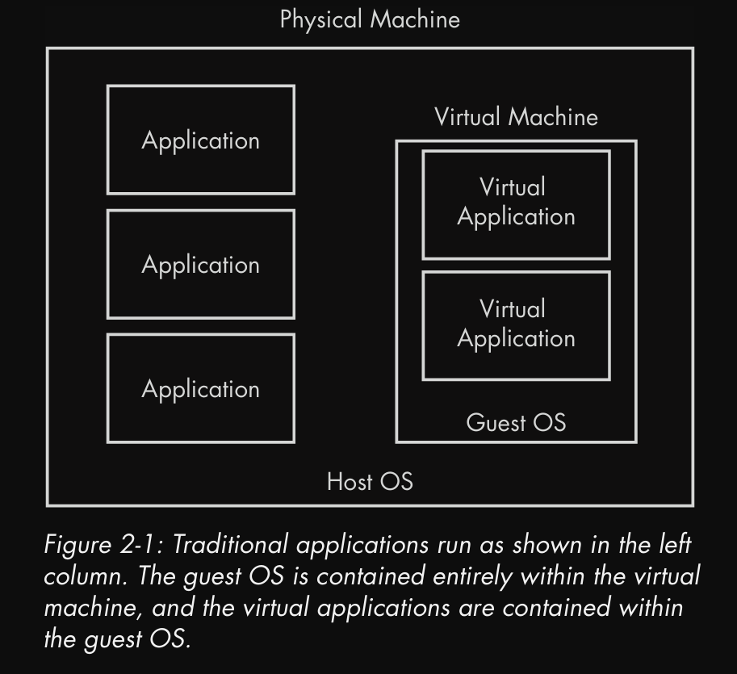

# Basic Techniques

<mark style="color:purple;">Static Analysis</mark>

### <mark style="color:red;">Antivirus Scanning</mark>

* Running it through multiple antivirus which may have already identified the malware, although they are not perfect
* They rely on identifiable pieces of suspicious code (file signatures) and behavior/pattern matching analysis (heuristics)
* [Virustotal](https://www.virustotal.com/) is great help here as it runs the malware through multiple antivirus systems

### <mark style="color:red;">Hashing : Fingerprinting a malware</mark>

* Hashing is common method where you run the malware through hashing programs
* They use algorithms such as MD5 or SHA-1 to produce unique hash (fingerprint)
* Hash then can be used as label or sharing it to other analyst to identify the malware or see if it has been already identified

### <mark style="color:red;">Finding Strings</mark>

* Strings can be great method to find texts within the malware
* ASCII and Unicode format are used to store strings
* They store by characters in sequence and ending with a NULL terminator to indicate that string is complete
* ASCII uses 1byte per character while Unicode uses 2bytes per character

<figure><figcaption></figcaption></figure>

<figure><figcaption></figcaption></figure>

* Sometimes if strings program identifies a sequence of characters which end with null terminator, it might think of it as string while it could be just some CPU instruction or memory address

### <mark style="color:red;">Packed and Obfuscated Malware</mark>

* Obfuscated malware are the one whose execution are hidden
* Packed malware is subset of obfuscated malware where the program is compressed making it harder to analyze
* When packed program is ran, a small wrapper program, it de-compresses the packed program and then executes unpacked program
* When packed program is analyzed statically, only wrapper program can be dissected

<figure><figcaption></figcaption></figure>

* Packers can be detected using software such as PEiD
* Packed program must be unpack so that we can analyze it

### <mark style="color:red;">Portable Executable File Format</mark>

* PE format is used by windows executables, object code and DLLs
* It contains necessary information for the Windows OS loader to manage the wrapped executable code
* PE files begin with a header that includes information about the code, type of the application, required library functions and space requirements

### <mark style="color:red;">Linked Library and Functions</mark>

* Imports are function that are used by program whilst they are stored in another program, such as code libraries that contain common functionality which are connected by linking
* Code libraries can be linked statically, at runtime or dynamically
* Static linking is not used often although it’s common in UNIX programs
* When code is statically linked, all the code from the library are copied to our main executable making it grow in size which makes analyzing code harder
* Runtime linking is commonly used in malwares especially when it’s obfuscated or packed
* Some linked functions can be imported without being listed in program headers like `LoadLibrary`, `LdrGetProcAddress` , `LdrLoadDll`and `GetProcAddress`
* Dynamic linking is the most common method of linking, where OS searches for all necessary linked libraries when the program is loaded
* Libraries used and called are very important for us to understand what the program does
* Functions can also be imported by ordinals making it harder for us to analyze
* Below are some common DLLs

<figure><figcaption></figcaption></figure>

* `Ex` is a suffix used when the function is updated by Microsoft
* `A` and `W` appearing at the end is extra information about suffix which doesn’t appear in actual documentation and is just there to tell us that function accepts ASCII string and word respectively
* Like imports, there are also exports, which are functions exported by programs so that other programs can import and utilize them, these are most common in DLLs

### <mark style="color:red;">PE File Headers and Sections</mark>

* `.text` section contains instructions code that CPU will execute
* `.rdata` section contains information about imports and exports, storing read only data
* `.data` contains global data accessible from anywhere in the program
* `.idata` stores data about import functions, usually not present
* `.edata` stores data about export functions, usually not present
* `.pdata` present only in 64bit applications storing exception-handling information
* `.rsrc` contains other data such as icons, images, menus and strings
* `.reloc` contains information about relocation of library files

### <mark style="color:red;">Some Tips and Trivia</mark>

* All Delphi programs use compile time of June 19, 1992
* Virtual size (space allocated for section during loading) and raw data (how big section is on disk) should be equal (small differences are fine), if they aren’t that means it’s a packed program

## <mark style="color:purple;">Malware Analysis in Virtual Machines</mark>

### <mark style="color:red;">Introduction</mark>

* One can analyze malware in either physical machine or virtual machine.
* Physical machine gives advantage of malware behaving the same was as intended though as it is on air-gapped network malware communications with internet might be hampered
* Virtual machine solves this but there is possibility that malware might behave differently on virtual machine than physical one making analysis hard

### <mark style="color:red;">Structure of Virtual Machine</mark>

* A virtual machine is computer within a computer, allowing complete isolation of virtual machine from host machine

<figure><figcaption></figcaption></figure>

* Using host-only network is common practice in VMs for malware analysis

<figure><figcaption></figcaption></figure>

* Taking snapshots is important before you analyze any malware so you can return back to original state once you are done with your work

<figure><figcaption></figcaption></figure>

## <mark style="color:purple;">Basic Dynamic Analysis</mark>

### <mark style="color:red;">Introduction</mark>

* Dynamic analysis is performed after we have exhausted our static analysis
* It allows us to observe actual behavior of the malware
* It is important to know how to run a malware if you want to perform dynamic analysis. Quite often it can be simple as double clicking the exe
* DLLs might be hard to run, there is tool called `rundll32.exe` which comes with all modern version of windows which has following syntax `rundll32.exe DLLname, Export Arguments`. Where `Export` value must be a function name or ordinal selected from exported function table in DLL which can be viewed using tools such as PEBear etc. Example syntax for both would be `rundll32.exe mal.dll, install` or `rundll32.exe mal.dll, #5` where `install` is the export function name and `#5` is the ordinal number prepended with `#`
* Malicious DLL quite often run their code in `DLLMain` (called from the DLL entry point) and as `DLLMain` is executed when DLL is loaded, we can force DLL to load via `rundll32.exe` to get information out of it
* One can also modify the PE header of DLL and change the extension and force windows to load DLL as EXE. To modify that, wipe the `IMAGE_FILE_DLL (0x2000)` flag from the characteristics field in the `IMAGE_FILE_HEADER` , thought it might cause malware to crash or terminate but as long as the changes cause malware to execute it’s payload, we are good to go.
* DLL malware may also be needed to install as service with following syntax `rundll32.exe mal.dll, InstallService ServiceName` and then to start the service `net start ServiceName`
* When there isn’t a export function such as `Install` or `InstallService` in the DLL, we may need to manually install the DLL as service via either Windows `sc` command or modifying the register for unused service and then using `net start` on that service. The service entries are located in `HKLM\\SYSTEM\\CurrentControlSet\\Services`

### <mark style="color:red;">Monitoring With Process Monitor</mark>

* Process monitor or procmon is powerful tool to monitor certain registry, file system, network, process and thread activity although it should not be usually use to log network activity as it is inconsistent throughout windows versions.
* Procmon can monitor all system calls as soon as it is ran making it impossible to look through all of them as they are over in thousands and it may crash our virtual machine, so it is advised to load it up, stop capturing, clear the events and capture for few minutes once you load the malware.
*
